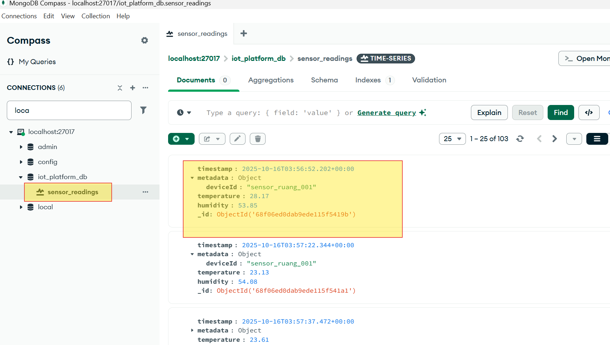
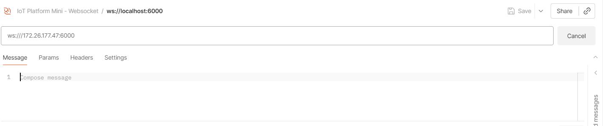

# Building the IoT Platform:

This IoT Platform is a smart and efficient system designed to ensure sensor data from field devices is processed quickly, stored securely, and presented to users instantly and historically.


## **Table of Contents**

Chapter 1: The Waking Sensor (Device IoT)

Chapter 2: The Busy Data Gate (MQTT Broker)

Chapter 3: The Bridging Savior (mqtt-rabbitmq-bridge.js)

Chapter 4: The Dual Crossroad (RabbitMQ Message Bus)

Chapter 5: Data Subscription and Delivery

Chapter 6: Key Component Functions

Chatper 7: Deploy Tools (RabbmitMQ, MQTT Broker, MongoDB) using Docker


## **Chapter 1: The Waking Sensor (Device IoT)**

The IoT Sensor Device is the "eyes" and "ears" of the platform. These are the hardware components in the field that sense real-world conditions, such as temperature, humidity, or pressure.

Main Actor: IoT Sensor Device

Action: The device routinely reads data (e.g., Temperature 28 Degrees, Humidity 53%) and packages it into a lightweight message format.

Protocol: Messages are sent using the MQTT Protocol, which is highly efficient and suitable for unstable networks or power-constrained devices.

Run device simulator for send data sensor
```
 cd backend  /src/simulator/
 node device-simulator.js
``` 


## **Chapter 2: The Busy Data Gate (MQTT Broker)**

The messages sent by the sensor do not go straight to the server but stop first at the MQTT Broker. This Broker acts as a distribution center that receives, validates, and forwards the messages.

Main Actor: MQTT Broker

Action: It receives all MQTT messages from the Sensor Devices, keeps the connection alive, and forwards the messages to the subscribing parties (your backend services).

This show data sensor was send to mqtt broker 


## **3. Chapter 3: The Bridging Savior (mqtt-rabbitmq-bridge.js)**

RabbitMQ, as the main message bus, does not communicate directly with MQTT. This is where the Node.js bridge comes in.

Main Actor: mqtt-rabbitmq-bridge.js (Bridge)

Function: This Bridge subscribes to the topic on the MQTT Broker. Every time a new message arrives, the Bridge immediately fetches it and publishes that message to RabbitMQ (using the iot_data_exchange name). This ensures the sensor data enters the centralized processing pipeline.

Run program brige mqtt to rabbitmq
```
 cd backend  /src/backend/
 node mqtt-rabbitmq-bridge.js
``` 


## **Chapter 4: The Dual Crossroad (RabbitMQ Message Bus)**

RabbitMQ is the heart of your backend architecture. It is a Message Broker that guarantees messages are not lost and can be distributed to multiple destinations simultaneously (Fanout pattern).

Main Actor: RabbitMQ

Action: Messages received from the Bridge are immediately duplicated and sent simultaneously to two backend services:

### 4.1 Data Storage Service (save-payload.js).

Run program save payload to mongo
```
 cd backend  /src/backend/
 node save-payload.js)
```


### 4.2 Realtime Data Service (realtime-server.js).

Run program realtime data


## **5. Chapter 5: Data Subscription and Delivery**

After leaving RabbitMQ, the data moves along two parallel paths, each serving different needs:

### Path A: Permanent Storage (Historical)

**Component: save-payload.js**

Function: This consumer is responsible for taking each message from RabbitMQ, processing it, and storing it permanently in the MongoDB Timeseries Database. This creates an indelible history record.

```
 cd backend  /src/backend/
 node save-payload.js
```




**Output: sensor-history.js**

Service: This Express/Node.js service serves the stored data via HTTP Protocol (RESTful API). This is what you successfully tested with Postman on localhost:4000, returning historical data based on time and deviceId filters.


### Path B: Instant Presentation (Realtime)

Component: realtime-server.js

Function: This is the second consumer from RabbitMQ. Its only task is to immediately take the latest data and stream it to connected web clients.

Protocol: This server uses the WebSocket Protocol (ws://...:6000). WebSocket maintains an open and persistent two-way connection between the server and the client.

Output: App Realtime Data Sensor

Function: The web application or dashboard that subscribes to this WebSocket connection receives the sensor data in realtime without needing to perform polling (repeatedly requesting data).

```
 cd backend  /src/backend/
 node realtime-server.js
```




## **6.  Key Component Functions**

6.1 Device Sensor IoT
    Function & Role: Data source; measures and transmits data payload.
    Protocol/Technology: MQTT Protocol

6.2 MQTT Broker
    Function & Role: First hub; receives and forwards messages from devices to the backend system.
    Protocol/Technology: MQTT

6.3 mqtt-rabbitmq-bridge.js
    Function & Role: Translator bridge; takes MQTT data and publishes it to RabbitMQ.
    Protocol/Technology: Node.js, MQTT Client, AMQP

6.4 RabbitMQ
    Function & Role: Message Bus. Guarantees reliable data delivery and distributes a single message to multiple consumers (Historical & Realtime).
    Protocol/Technology: AMQP

6.5 save-payload.js
    Function & Role: RabbitMQ Consumer; responsible for persistent data storage in the database.
    Protocol/Technology: Node.js, Mongoose, MongoDB

6.6 MongoDB Timeseries
    Function & Role: Specialized database for storing time-series data efficiently (history).
    Protocol/Technology: Database

6.7 sensor-history.js
    Function & Role: Serves the stored historical data upon user request.
    Protocol/Technology: HTTP (RESTful API)

6.8 realtime-server.js
    Function & Role: Streams the latest data instantly to connected web clients.
    Protocol/Technology: WebSock


**Chapter 7: Deploy Tools (RabbmitMQ, MQTT Broker, MongoDB) using Docker**    

For deploy RabbmitMQ, MQTT Broker, MongoDB) canuser docker compose 

```
  docker-compose up -d
```


  
